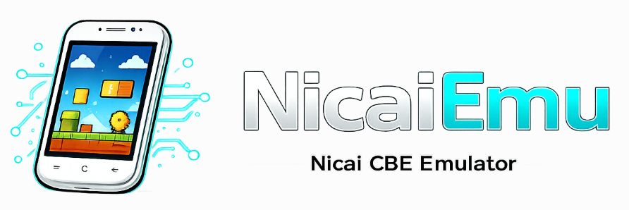

# NicaiEmu — A Nicai/MStar CBE game emulator written in Rust

<p align="center">
  
</p>

<p align="center">
  <a href="https://aloyshf.github.io/NicaiEmu/"></a>
  <a href="https://github.com/AloysHF/NicaiEmu/actions/workflows/ci.yml"></a>
  <a href="https://git.libretro.com/libretro/nicaiemu/-/pipelines"></a>
  <a href="https://github.com/AloysHF/NicaiEmu/releases/latest"></a>
  <a href="https://github.com/AloysHF/NicaiEmu/releases"></a>
  <a href="https://sonarcloud.io/dashboard?id=AloysHF_NicaiEmu"></a>
  <a href="LICENSE"></a>
  <a href="https://discord.gg/7XDdSrYD"></a>
  <a href="https://qm.qq.com/q/LAO7DKAWUC"></a>
</p>

NicaiEmu is a Rust emulator for ARM/Thumb CBE applications used by Nicai/MStar
mobile phones. It loads the executable and packaged resources directly, runs
guest code through a pure-Rust ARM core, and bridges the phone services needed
by supported games.

## Features

- **CBE format support** — section parsing, installed-package extraction,
  resource lookup, image decoding
- **ARM/Thumb CPU emulation** — little- and big-endian execution, interworking branches
- **Service bridge** — firmware-style API for memory, resources, display,
  input, text, fixed-point game math, and packed-rectangle collision detection
- **Guest filesystem** — sandboxed in-memory files used by CBE installers and
  file-backed resource packages
- **Graphics rendering** — RGB565 framebuffer with GIF and PNG image reconstruction
- **Text rendering** — GBK decoding with embedded Unicode bitmap font
- **240×400 display** — native WQVGA resolution with resizable desktop window
- **Automatic landscape rotation** — games packaged for the original phone's
  rotated landscape LCD are presented at 400×240 automatically, with a
  `--rotate` override for manual control and a `--rotation-profile` file for
  titles outside the built-in profile
- **Display scaling** — nearest, bilinear, bicubic, and xbrz filters with
  aspect-ratio-preserving centering (`--filter`)
- **Key remapping** — rebind any guest key to any host key (`--remap`)
- **Virtual gamepad overlay** — visual phone keypad over the game frame
  (`--show-gamepad`)
- **Fullscreen and volume** — borderless fullscreen and 0–100 playback volume
  (`--fullscreen`, `--volume`)
- **Headless mode** — run N frames without a window for testing and batch
  processing (`--headless --frames`)
- **Screenshot capture** — automated PNG screenshot generation
- **Save states** — versioned, checksummed snapshots of the full machine state
  through the libretro API and the standalone `--save-state` / `--load-state`
  options
- **Reset** — rebuilds the emulator runtime state from the loaded archive
  (standalone `R` key and libretro `retro_reset`)
- **Guest memory exposure** — libretro exposes the guest heap and screen
  framebuffer to frontend memory tools
- **Audio** — WAV/MP3 decoding and MIDI synthesis, stereo mixing, volume
  control, and 44.1 kHz output through the libretro sample callback and the
  standalone device sink; `--auto-bgm` plays the first packaged MIDI resource
  when a game never calls the audio manager on its own (file-based MP3 control
  is a planned follow-up)
- **Touch input** — the guest touchscreen responds to mouse clicks in the
  standalone frontend and to pointer devices (mouse or touchscreen) in
  RetroArch
- **Libretro integration** — playable libretro core with RGB888 video output,
  RetroPad input, content loading, save states, reset, and memory exposure
  (core options cover volume, touch input, auto BGM, display rotation, and
  debug logging); landscape titles are presented rotated at 400×240, matching
  the standalone frontend

## Usage

### Standalone Mode

Download the latest binary from the
[Releases](https://github.com/AloysHF/NicaiEmu/releases) page and run:

```bash
nicaiemu path/to/game.CBE
```

See the [Standalone Emulator](docs/Standalone-Emulator.md) guide for
installation, keyboard controls, headless mode, screenshots, and all
command-line options.

### RetroArch Mode

Install the core and load a game through RetroArch's **Load Content** menu.

See the [RetroArch Core](docs/RetroArch-Core.md) guide for installation,
supported platforms, RetroPad mapping, and features.

## Building

Requires [Rust](https://www.rust-lang.org/tools/install) (stable).

### Standalone Mode

```bash
cargo build -p nicaiemu --release
cargo run -p nicaiemu --release -- path/to/game.CBE
```

### Libretro Core (for RetroArch)

```bash
cargo build -p nicaiemu-libretro --release
```

The binary is produced at `target/release/nicaiemu.dll`
(`libnicaiemu.so` on Linux, `libnicaiemu.dylib` on macOS). Rename it to
`nicaiemu_libretro.<ext>` before placing it in RetroArch's `cores/`
directory.

For Android cross-compilation, see [Android Libretro Core](docs/Android-Libretro-Core.md).
For iOS, see [iOS Libretro Core](docs/iOS-Libretro-Core.md).

## Architecture

```
crates/
├── nicaiemu-core/         # Platform-independent emulator engine (library)
│   └── src/
│       ├── lib.rs            # Crate root and public re-exports
│       ├── cbe/              # CBE container parsing
│       │   ├── mod.rs        # Archive and resource-type definitions
│       │   ├── archive.rs    # Section/resource scanning and loading
│       │   ├── sce.rs        # Scene resource decoder
│       │   ├── map.rs        # Map resource decoder
│       │   ├── actor.rs      # Actor resource decoder
│       │   └── resource.rs   # Resource entry helpers
│       ├── machine/          # Guest machine (NicaiMachine)
│       │   ├── mod.rs        # Executable parsing, boot, frame loop, input
│       │   ├── memory.rs     # Sparse guest memory regions
│       │   ├── packages.rs   # Guest resource package parsing
│       │   ├── virtual_fs.rs # Sandboxed guest filesystem
│       │   ├── cpu_bridge.rs # Execution loop and service dispatch
│       │   ├── drawing.rs    # Framebuffer drawing, blits, and text
│       │   └── services/     # Firmware service handlers by manager
│       ├── audio_engine.rs   # WAV/MP3/MIDI decoding and mixing
│       ├── image_decoder.rs  # CBE GIF and firmware PNG decoding
│       ├── save_state.rs     # Versioned, checksummed save-state codec
│       └── runtime.rs        # Scene-level HLE (crate-internal, experimental)
├── nicaiemu/              # Standalone binary (→ nicaiemu)
│   └── src/
│       ├── main.rs           # Window loop, CLI, input, audio output
│       └── standalone/       # Display scalers, gamepad overlay, key mapper
├── nicaiemu-tools/        # Archive analysis and headless diagnostics
│   └── src/
│       ├── bin/
│       │   ├── cbe_boot.rs   # Headless boot tool
│       │   ├── cbe_analyze.rs # Archive analysis tool
│       │   └── cbe_disasm.rs # ARM/Thumb disassembly tool
└── nicaiemu-libretro/     # Libretro cdylib (→ nicaiemu_libretro.{dll,so,dylib})
    ├── nicaiemu_libretro.info   # RetroArch core metadata
    └── src/
        ├── lib.rs               # cdylib crate root
        └── libretro/
            ├── api.rs           # Exported libretro functions
            ├── callbacks.rs     # Callback management
            ├── constants.rs     # libretro constants
            ├── logger.rs        # Bridges the `log` crate to the frontend
            └── types.rs         # libretro type definitions
```

See [Architecture](docs/architecture.md) for implementation details.

## Key Mappings (Standalone)

| Phone Input | Keyboard |
| --- | --- |
| Direction pad | Arrow keys or WASD |
| Confirm | Enter or F |
| Left soft key | Q |
| Right soft key | E |
| Numeric keypad | 0–9 |
| Additional keys | N / M |
| Exit | Escape |

Direction keys remain visible to the guest while physically held. Guest logic
runs at the platform's 10 Hz screen-update rate, so continuous-motion games
walk smoothly without flooding tile-based games with 30 updates per second.

## Game Compatibility

The emulator supports CBE applications for Nicai/MStar phones with 240×400
display. 74 out of 74 tested games render startup frames successfully.

| Status | Count |
|--------|-------|
| ✅ Pass | 74 |
| ❌ Fail | 0 |
| 🌐 Requires network | 17 |

Applications that require the original phone's GPRS connection (online games,
news/book/music/map/email services, operator download services) are marked
🌐 Required in the full list; the emulator implements no network stack, so
they stop at their login, self-update, or connection-error screens.

For the full game list with screenshots, see [Game Compatibility](docs/Game-Compatibility.md).

## Testing

Run the unit tests:

```bash
cargo test --workspace --release
```

Game files are not included. Supply legally obtained CBE applications separately.

## Contributing

Contributions are welcome! Whether you're interested in fixing bugs, adding
features, improving documentation, or testing game compatibility, we'd love your
help. See [CONTRIBUTING.md](docs/CONTRIBUTING.md) for details.

## License

This project is licensed under the [BSD 3-Clause License](LICENSE).
