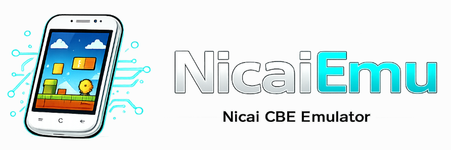

# NicaiEmu — A Nicai/MStar CBE game emulator written in Rust

<p align="center">
  
</p>

<p align="center">
  <a href="https://aloyshf.github.io/NicaiEmu/"></a>
  <a href="https://github.com/AloysHF/NicaiEmu/actions/workflows/ci.yml"></a>
  <a href="https://git.libretro.com/libretro/nicaiemu/-/pipelines"></a>
  <a href="https://github.com/AloysHF/NicaiEmu/releases/latest"></a>
  <a href="https://github.com/AloysHF/NicaiEmu/releases"></a>
  <a href="https://sonarcloud.io/dashboard?id=AloysHF_NicaiEmu"></a>
  <a href="LICENSE"></a>
  <a href="https://discord.gg/7XDdSrYD"></a>
  <a href="https://qm.qq.com/q/LAO7DKAWUC"></a>
</p>

NicaiEmu is a Rust emulator for ARM/Thumb CBE applications used by Nicai/MStar
mobile phones. It loads the executable and packaged resources directly, runs
guest code through a pure-Rust ARM core, and bridges the phone services needed
by supported games.

## Features

- **CBE format support** — section parsing, installed-package extraction,
  resource lookup, image decoding
- **ARM/Thumb CPU emulation** — little- and big-endian execution, interworking branches
- **Service bridge** — firmware-style API for memory, resources, display,
  input, text, little-endian game-data reads, DF panel invalidation,
  fixed-point game math, and
  packed-rectangle collision detection
- **Guest filesystem** — sandboxed in-memory files used by CBE installers and
  file-backed resource packages
- **Graphics rendering** — RGB565 framebuffer with GIF and PNG image reconstruction
- **Text rendering** — GBK decoding with embedded Unicode bitmap font
- **240×400 display** — native WQVGA resolution; standalone window opens at
  1:1 by default and supports integer `--scale` (1–8)
- **Automatic landscape rotation** — games packaged for the original phone's
  rotated landscape LCD are presented at 400×240 automatically, with a
  landscape default window matching the frame, a `--orientation` override
  for manual control, and a `--orientation-profile` file for titles outside the
  built-in profile
- **Display scaling** — nearest, bilinear, bicubic, and xbrz filters with
  aspect-ratio-preserving centering (`--filter`)
- **Key remapping** — rebind any guest key to any host key (`--remap`)
- **Physical gamepad input** — first connected pad drives guest keys via gilrs,
  RetroPad-compatible mapping, keyboard and pad combine as a logical OR
  (`--no-gamepad` disables the pad)
- **Virtual gamepad overlay** — translucent gamepad-layout dock (numeric row,
  large D-pad, centered OK, face-key diamond) highlighting held keys
  (`--show-gamepad`)
- **Fullscreen and volume** — borderless fullscreen and 0–100 playback volume
  (`--fullscreen`, `--volume`)
- **Window backend selection** — on Linux/BSD the default prefers X11
  (XWayland) so the desktop supplies standard window buttons such as maximize
  and close; XWayland HiDPI sessions keep the window's on-screen size by
  compensating for the denser X11 coordinate space; `--window-backend` forces
  `x11` or `wayland`
- **Headless mode** — run N frames without a window for testing and batch
  processing (`--headless --frames`)
- **Screenshot capture** — automated PNG screenshot generation
- **Save states** — versioned, checksummed snapshots of the full machine state
  through the libretro API and the standalone `--save-state` / `--load-state`
  options
- **Reset** — rebuilds the emulator runtime state from the loaded archive
  (standalone `R` key and libretro `retro_reset`)
- **Guest memory exposure** — libretro exposes the guest heap and screen
  framebuffer to frontend memory tools
- **Audio** — WAV/MP3 decoding and MIDI synthesis, stereo mixing, volume
  control, and 44.1 kHz output through the libretro sample callback and the
  standalone device sink; `--auto-bgm` plays the first packaged MIDI resource
  when a game never calls the audio manager on its own (file-based MP3 control
  is a planned follow-up)
- **Touch input** — the guest touchscreen responds to mouse clicks in the
  standalone frontend and to pointer devices (mouse or touchscreen) in
  RetroArch
- **Libretro integration** — playable libretro core with RGB888 video output,
  RetroPad input, content loading, save states, reset, and memory exposure
  (core options cover volume, touch input, auto BGM, screen orientation, and
  debug logging); landscape titles are presented rotated at 400×240, matching
  the standalone frontend

## Usage

### Standalone Mode

Download the latest binary from the
[Releases](https://github.com/AloysHF/NicaiEmu/releases) page and run:

```bash
nicaiemu path/to/game.CBE
```

See the [Standalone Emulator](docs/Standalone-Emulator.md) guide for
installation, keyboard and gamepad controls, headless mode, screenshots, and
all command-line options.

### RetroArch Mode

Install the core and load a game through RetroArch's **Load Content** menu.

See the [RetroArch Core](docs/RetroArch-Core.md) guide for installation,
supported platforms, RetroPad mapping, and features.

## Building

Requires [Rust](https://www.rust-lang.org/tools/install) (stable).

### Standalone Mode

```bash
cargo build -p nicaiemu --release
cargo run -p nicaiemu --release -- path/to/game.CBE
```

### Libretro Core (for RetroArch)

```bash
cargo build -p nicaiemu-libretro --release
```

The binary is produced at `target/release/nicaiemu.dll`
(`libnicaiemu.so` on Linux, `libnicaiemu.dylib` on macOS). Rename it to
`nicaiemu_libretro.<ext>` before placing it in RetroArch's `cores/`
directory.

For Android cross-compilation, see [Android Libretro Core](docs/Android-Libretro-Core.md).
For iOS, see [iOS Libretro Core](docs/iOS-Libretro-Core.md).

## Architecture

```
crates/
├── nicaiemu-core/         # Platform-independent emulator engine (library)
│   └── src/
│       ├── lib.rs            # Crate root and public re-exports
│       ├── cbe/              # CBE container parsing
│       │   ├── mod.rs        # Archive and resource-type definitions
│       │   ├── archive.rs    # Section/resource scanning and loading
│       │   ├── sce.rs        # Scene resource decoder
│       │   ├── map.rs        # Map resource decoder
│       │   ├── actor.rs      # Actor resource decoder
│       │   └── resource.rs   # Resource entry helpers
│       ├── machine/          # Guest machine (NicaiMachine)
│       │   ├── mod.rs        # Executable parsing, boot, frame loop, input
│       │   ├── memory.rs     # Sparse guest memory regions
│       │   ├── packages.rs   # Guest resource package parsing
│       │   ├── virtual_fs.rs # Sandboxed guest filesystem
│       │   ├── cpu_bridge.rs # Execution loop and service dispatch
│       │   ├── drawing.rs    # Framebuffer drawing, blits, and text
│       │   └── services/     # Firmware service handlers by manager
│       ├── audio_engine.rs   # WAV/MP3/MIDI decoding and mixing
│       ├── image_decoder.rs  # CBE GIF and firmware PNG decoding
│       ├── save_state.rs     # Versioned, checksummed save-state codec
│       └── runtime.rs        # Scene-level HLE (crate-internal, experimental)
├── nicaiemu/              # Standalone binary (→ nicaiemu)
│   └── src/
│       ├── main.rs           # Window loop, CLI, input, audio output
│       └── standalone/       # Display scalers, gamepad overlay, key/gamepad mappers, window backend
├── nicaiemu-tools/        # Archive analysis and headless diagnostics
│   └── src/
│       ├── bin/
│       │   ├── cbe_boot.rs   # Headless boot tool
│       │   ├── cbe_analyze.rs # Archive analysis tool
│       │   └── cbe_disasm.rs # ARM/Thumb disassembly tool
└── nicaiemu-libretro/     # Libretro cdylib (→ nicaiemu_libretro.{dll,so,dylib})
    ├── nicaiemu_libretro.info   # RetroArch core metadata
    └── src/
        ├── lib.rs               # cdylib crate root
        └── libretro/
            ├── api.rs           # Exported libretro functions
            ├── callbacks.rs     # Callback management
            ├── constants.rs     # libretro constants
            ├── logger.rs        # Bridges the `log` crate to the frontend
            └── types.rs         # libretro type definitions
```

See [Architecture](docs/architecture.md) for implementation details.

## Controls

The games expect a phone keypad and a touchscreen. NicaiEmu offers three
input modes, all supported by both the standalone app and the RetroArch
core:

| Input mode | Standalone | RetroArch core |
| --- | --- | --- |
| Touch | ✅ mouse clicks act as touch (touchscreen taps arrive as clicks) | ✅ touchscreen and mouse via the pointer device |
| Keyboard + mouse | ✅ full phone keypad | ✅ full phone keypad (enable Game Focus, Scroll Lock) |
| Gamepad | ✅ | ✅ identical RetroPad mapping |

What playing feels like:

- **Touch** — the natural fit: these titles are designed for touchscreens,
  so menus and in-game controls just work wherever you tap.
- **Keyboard + mouse** — mouse clicks are touch input on both frontends,
  and the keyboard presses the full phone keypad in both. In RetroArch,
  turn on **Game Focus** (Scroll Lock) first so keys reach the core instead
  of RetroArch's hotkeys.
- **Gamepad** — one RetroPad-compatible mapping shared by both frontends.
  Hold **Select** for a number layer: directions 1–4, face buttons 5–8,
  Start 9, shoulders 0.

Notes and limits:

- A few titles are not playable for unrelated reasons (for example the
  network-dependent ones). See [Game Compatibility](docs/Game-Compatibility.md).
- Network-dependent titles count as compatible once they start; services
  provided by defunct external servers are outside the startup criterion.
- The network application manager preserves entry descriptors and dispatches
  their startup callbacks independently of the manager initialization directory.
- The standalone `--show-gamepad` overlay is a read-only debug view of the
  merged key state, not a playable virtual keyboard.

Detailed references by input mode:

- **Touch** —
  [Standalone: mouse as touch](docs/Standalone-Emulator.md#default-key-mappings) ·
  [RetroArch: Touch Input](docs/RetroArch-Core.md#touch-input)
- **Keyboard + mouse** —
  [Standalone: Default Key Mappings](docs/Standalone-Emulator.md#default-key-mappings) ·
  [RetroArch: Keyboard Input](docs/RetroArch-Core.md#keyboard-input)
- **Gamepad** —
  [Standalone: Physical Gamepads](docs/Standalone-Emulator.md#physical-gamepads) ·
  [RetroArch: RetroPad Button Mapping](docs/RetroArch-Core.md#retropad-button-mapping)
- **Debug overlay** —
  [Standalone: Virtual Gamepad Overlay](docs/Standalone-Emulator.md#virtual-gamepad-overlay)

## Game Compatibility

| Status | Count |
|--------|-------|
| ✅ Pass | 74 |
| ❌ Fail | 0 |
| 🌐 Requires network | 17 |

For the full game list with screenshots, see [Game Compatibility](docs/Game-Compatibility.md).

Private I/O manager tables preserve the firmware's NV method discovery layout.
This lets fixed-address applications initialize their storage callbacks without
calling null pointers; successful startup does not guarantee complete gameplay.

Resource lookup distinguishes the file-package marker from adjacent fields in
compact memory packages. This restores dynamic code lookup for some titles;
reaching an active screen still requires visual and input validation.
Modal dialogs may pause screen callbacks; the frame remains visible while
deferred results restore the guest screen.
Legacy text-box initialization uses its declared object layout and preserves
adjacent screen state.
Text boxes wrap GBK text into guest line tables, track pages, draw screen or
image targets, and release their owned line buffers.
Legacy GameLCD supports image creation, clipped opaque/transparent blits,
dimension queries and bounded GBK text with RGB888 colors.
The fixed legacy game manager uses the same text renderer and returns concrete
font metrics, allowing guest wrapping loops to make progress.
Its full-screen, clipped image and clip-query entry points share GameLCD drawing.
Legacy window repaint dispatches guest painters for dirty rectangles and
walks child and sibling windows while preserving caller registers.
Legacy picture libraries support resource loading, cached image indices, image
sizes, clipped drawing, rectangle fills, target selection, and release.
Fixed-address picture-library entry points use the same implementation.
Unknown object methods use separate inert stubs so they cannot invoke global
manager constructors or overwrite saved return addresses.

Native file requests support open, close, size, read and write through the same
guest filesystem, including their deferred scalar-result retrieval. This fixes
required startup file creation; it does not implement missing native object
methods or establish that a previously blank application is now usable.


Pending resource callbacks bound to a new screen run before its initialization,
so initialization can use the objects created by resource loading. Requests
issued during initialization still run before logic and rendering.

## Testing

Run the unit tests:

```bash
cargo test --workspace --release
```

Game files are not included. Supply legally obtained CBE applications separately.

## Contributing

Contributions are welcome! Whether you're interested in fixing bugs, adding
features, improving documentation, or testing game compatibility, we'd love your
help. See [CONTRIBUTING.md](docs/CONTRIBUTING.md) for details.

## License

This project is licensed under the [BSD 3-Clause License](LICENSE).

### Native DF startup coverage (PR 71)

Native DF constructors are bound in both registered and queried function tables.
Registered screens take over the frame lifecycle after resource loading, and
native idle logic can poll a press edge within the same frame. Record files use
bounded sections with little-endian headers and values. Window callbacks receive
stack-passed contexts and paint queued dirty rectangles. Animation resources load
image references and cumulative frame timing; mirrored parts and collision
methods remain unsupported.

These changes restore visible content in the Metal new startup path. Its
continuation prompt and subsequent menus are still under investigation; rendering
a title is not evidence of playable compatibility.
