# Game Compatibility

CBE applications in the local validation corpus were run by the standalone emulator with default or application-specific capture timing. Every screenshot below is the RGB565 framebuffer produced by guest execution. If an application stops, times out, or leaves a single-color framebuffer, the batch does not create a screenshot. A successful startup capture does not guarantee that every screen or gameplay path works correctly.

The Network column in the application list identifies applications that
require the original phone's GPRS connection and cannot be played or used
offline. These services belong to a long-gone WAP/GPRS era: their back-end
servers were shut down years ago, so they no longer work even on original
hardware, regardless of emulator network support.

Games packaged for the original phone's rotated landscape display present the
240×400 framebuffer rotated 90 degrees counterclockwise as 400×240. The
rotation is resolved automatically from a content-identity profile keyed by
archive CRC-32 and size (not by file name), so the screenshots below match how
the titles appear on the original hardware.

## Supported Application Profile

The current core recognizes little- and big-endian ARM/Thumb CBE executables designed for a 240×400 display, including variable segment headers and fixed-address manager-directory variants. It implements the firmware subsets needed for memory blocks, native and installed data packages, image and text drawing, screen changes, sandboxed guest files, timers, and keypad input.

Validated behavior includes executable initialization, startup and narrative screens, archive extraction, file-backed resource-image decoding, Chinese text and HUD rendering, keypad input, fixed-point trigonometry, packed-rectangle collision detection, and continued frame execution. Headless capture preserves a valid guest-rendered framebuffer if a later callback stops.

These applications are marked 🌐 Required in the list below. They are
unusable today primarily because their service providers shut the servers
down long ago; the firmware network manager also being unimplemented in the
emulator only moves that failure earlier, to the login, self-update, or
connection-error screens the screenshots show.

## Summary

| Status | Count |
| --- | ---: |
| ✅ Pass | 74 |
| ❌ Fail | 0 |
| 🌐 Requires network | 17 |
| **Total** | **74** |

## Application List

The Network column marks applications whose content or gameplay requires the
original phone's GPRS connection: online game logins, network-fed content
services (news, books, music, maps, email, weather, time sync), and operator
download services (ringback tones, videos). The flags follow from guest calls
to the firmware network manager observed in headless service traces and from
the applications' own login or network screens shown in the screenshots.
Applications that only read billing identifiers at startup but remain fully
playable offline are not flagged. Note that the flag describes the
application as designed, not a limitation that better emulator network
support could lift: the services behind these titles no longer exist.

| # | Application | File | Screenshot | Network | Status |
| ---: | --- | --- | --- | --- | --- |
| 1 | 暴打小猪 | tmp/nicai_game/暴打小猪.CBE |  | — | ✅ Pass |
| 2 | 暴力摩托 | tmp/nicai_game/暴力摩托.CBE | 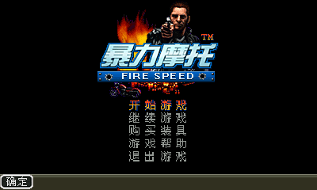 | — | ✅ Pass |
| 3 | 捕鱼猎人 | tmp/nicai_game/捕鱼猎人.CBE |  | — | ✅ Pass |
| 4 | 打地鼠 | tmp/nicai_game/打地鼠.CBE |  | — | ✅ Pass |
| 5 | 打火机 | tmp/nicai_game/打火机.CBE | 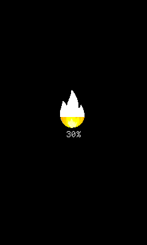 | — | ✅ Pass |
| 6 | 大家来数钱 | tmp/nicai_game/大家来数钱.CBE |  | — | ✅ Pass |
| 7 | 电子邮件 | tmp/nicai_game/电子邮件.CBE |  | 🌐 Required | ✅ Pass |
| 8 | 动感骰子 | tmp/nicai_game/动感骰子.CBE |  | — | ✅ Pass |
| 9 | 恶魔城 | tmp/nicai_game/恶魔城.CBE | 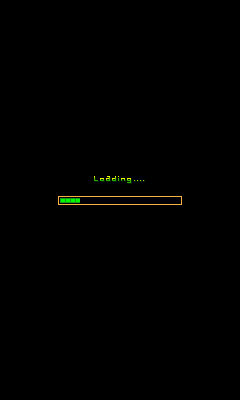 | — | ✅ Pass |
| 10 | 恶魔城登录版 | tmp/nicai_game/恶魔城登录版.CBE | 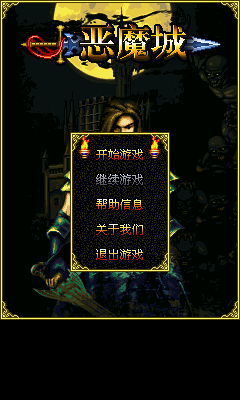 | 🌐 Required | ✅ Pass |
| 11 | 法老祖玛2 | tmp/nicai_game/法老祖玛2.CBE | 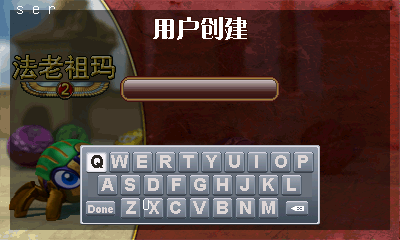 | — | ✅ Pass |
| 12 | 愤怒的小鸟 | tmp/nicai_game/愤怒的小鸟.CBE | 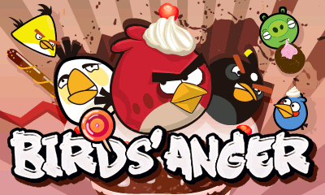 | — | ✅ Pass |
| 13 | 疯狂捕鸟 | tmp/nicai_game/疯狂捕鸟.CBE |  | — | ✅ Pass |
| 14 | 疯狂斗地主 | tmp/nicai_game/疯狂斗地主.CBE |  | — | ✅ Pass |
| 15 | 疯狂企鹅大冒险 | tmp/nicai_game/疯狂企鹅大冒险.CBE | 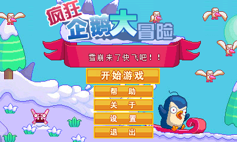 | — | ✅ Pass |
| 16 | 割绳子 | tmp/nicai_game/割绳子.CBE | 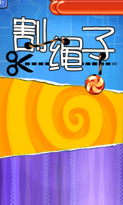 | — | ✅ Pass |
| 17 | 割绳子冬季版 | tmp/nicai_game/割绳子冬季版.CBE | 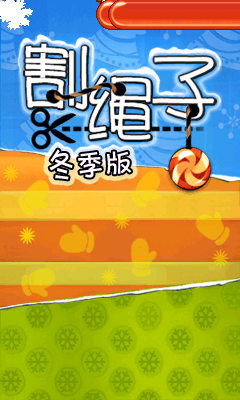 | — | ✅ Pass |
| 18 | 孤岛 | tmp/nicai_game/孤岛.CBE | 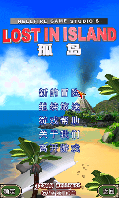 | — | ✅ Pass |
| 19 | 鬼吹灯 | tmp/nicai_game/鬼吹灯.CBE | 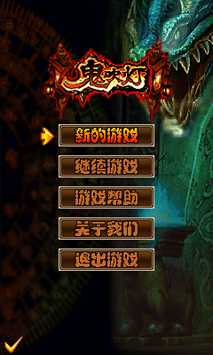 | — | ✅ Pass |
| 20 | 果蔬连连看 | tmp/nicai_game/果蔬连连看.CBE |  | — | ✅ Pass |
| 21 | 皇牌空战 | tmp/nicai_game/皇牌空战.CBE |  | — | ✅ Pass |
| 22 | 火辣美女视频 | tmp/nicai_game/火辣美女视频.CBE |  | 🌐 Required | ✅ Pass |
| 23 | 机场指挥部 | tmp/nicai_game/机场指挥部.CBE | 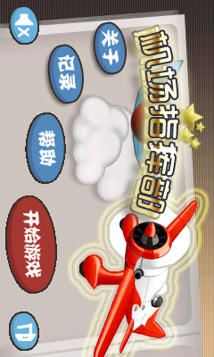 | — | ✅ Pass |
| 24 | 激情砖块 | tmp/nicai_game/激情砖块.CBE |  | — | ✅ Pass |
| 25 | 极品飞车2012 | tmp/nicai_game/极品飞车2012.CBE | 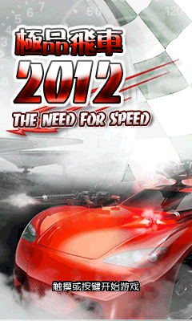 | — | ✅ Pass |
| 26 | 江湖Online | tmp/nicai_game/江湖Online.CBE |  | 🌐 Required | ✅ Pass |
| 27 | 僵尸先生 | tmp/nicai_game/僵尸先生.CBE |  | — | ✅ Pass |
| 28 | 开心大富翁 | tmp/nicai_game/开心大富翁.CBE |  | — | ✅ Pass |
| 29 | 雷电 | tmp/nicai_game/雷电.CBE | 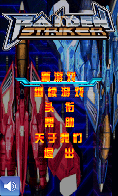 | — | ✅ Pass |
| 30 | 雷霆战机 | tmp/nicai_game/雷霆战机.CBE | 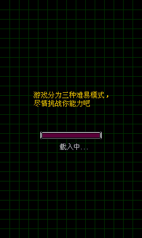 | — | ✅ Pass |
| 31 | 马戏团 | tmp/nicai_game/马戏团.CBE |  | — | ✅ Pass |
| 32 | 猫和老鼠 | tmp/nicai_game/猫和老鼠.CBE | 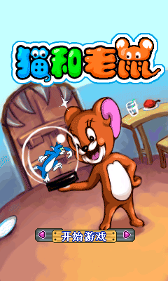 | — | ✅ Pass |
| 33 | 美女桌球 | tmp/nicai_game/美女桌球.CBE |  | — | ✅ Pass |
| 34 | 魔鬼理发师 | tmp/nicai_game/魔鬼理发师.CBE | 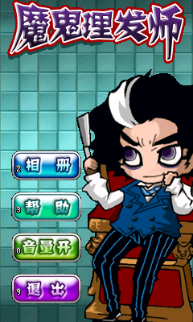 | — | ✅ Pass |
| 35 | 魔兽塔防 | tmp/nicai_game/魔兽塔防.CBE | 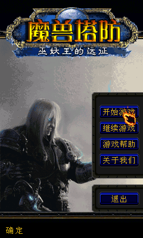 | — | ✅ Pass |
| 36 | 魔塔 | tmp/nicai_game/魔塔.CBE | 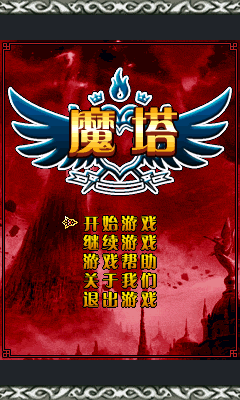 | — | ✅ Pass |
| 37 | 牧场物语 | tmp/nicai_game/牧场物语.CBE |  | — | ✅ Pass |
| 38 | 碰嘭球 | tmp/nicai_game/碰嘭球.CBE |  | — | ✅ Pass |
| 39 | 枪之荣誉 | tmp/nicai_game/枪之荣誉.CBE | 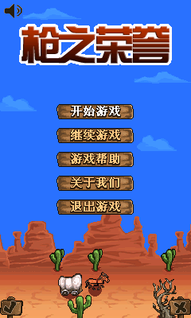 | — | ✅ Pass |
| 40 | 热辣美图 | tmp/nicai_game/热辣美图.CBE |  | — | ✅ Pass |
| 41 | 忍者跳跃 | tmp/nicai_game/忍者跳跃.CBE | 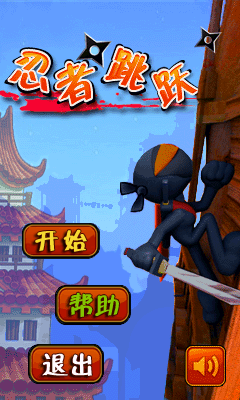 | — | ✅ Pass |
| 42 | 三国群殴传 | tmp/nicai_game/三国群殴传.CBE | 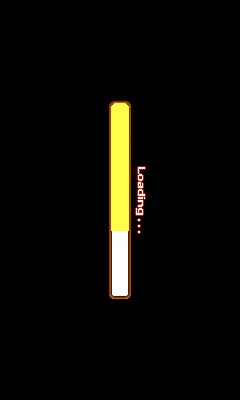 | — | ✅ Pass |
| 43 | 时间同步 | tmp/nicai_game/时间同步.CBE |  | 🌐 Required | ✅ Pass |
| 44 | 士兵突袭 | tmp/nicai_game/士兵突袭.CBE | 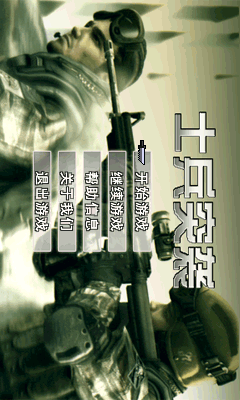 | — | ✅ Pass |
| 45 | 世纪佳缘 | tmp/nicai_game/世纪佳缘.CBE |  | 🌐 Required | ✅ Pass |
| 46 | 水果达人 | tmp/nicai_game/水果达人.CBE | 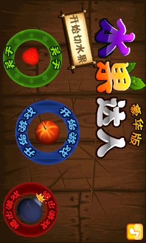 | — | ✅ Pass |
| 47 | 天气精灵 | tmp/nicai_game/天气精灵.CBE | 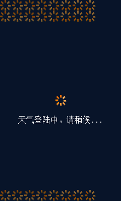 | 🌐 Required | ✅ Pass |
| 48 | 涂鸦跳跃 | tmp/nicai_game/涂鸦跳跃.CBE | 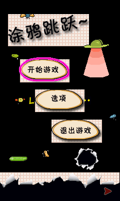 | — | ✅ Pass |
| 49 | 歪歪猫发条城历险记V100 | tmp/nicai_game/歪歪猫发条城历险记V100.CBE |  | 🌐 Required | ✅ Pass |
| 50 | 万年历 | tmp/nicai_game/万年历.CBE | 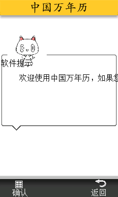 | — | ✅ Pass |
| 51 | 武林外传(新品) | tmp/nicai_game/武林外传(新品).CBE |  | — | ✅ Pass |
| 52 | 武林外传V10 | tmp/nicai_game/武林外传V10.CBE |  | — | ✅ Pass |
| 53 | 吸血鬼猎人 | tmp/nicai_game/吸血鬼猎人.CBE | 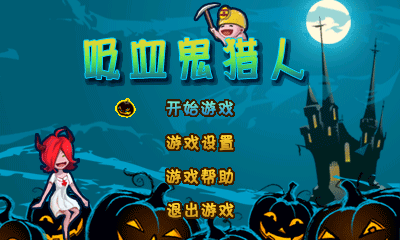 | — | ✅ Pass |
| 54 | 现代情趣大全 | tmp/nicai_game/现代情趣大全.CBE |  | — | ✅ Pass |
| 55 | 消息盒子 | tmp/nicai_game/消息盒子.CBE |  | — | ✅ Pass |
| 56 | 小酷 | tmp/nicai_game/小酷.CBE | 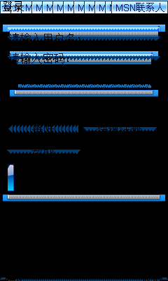 | — | ✅ Pass |
| 57 | 小鸟愤怒冬季版 | tmp/nicai_game/小鸟愤怒冬季版.CBE |  | — | ✅ Pass |
| 58 | 笑死人 | tmp/nicai_game/笑死人.CBE |  | — | ✅ Pass |
| 59 | 新闻 | tmp/nicai_game/新闻.CBE | 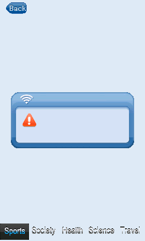 | 🌐 Required | ✅ Pass |
| 60 | 幸运扑克机 | tmp/nicai_game/幸运扑克机.CBE | 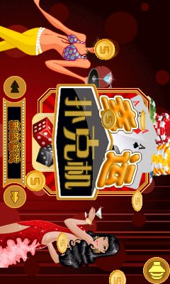 | — | ✅ Pass |
| 61 | 性爱宝典 | tmp/nicai_game/性爱宝典.CBE |  | — | ✅ Pass |
| 62 | 性爱高手 | tmp/nicai_game/性爱高手.CBE | 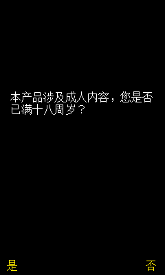 | — | ✅ Pass |
| 63 | 雄霸天下 | tmp/nicai_game/雄霸天下.CBE |  | 🌐 Required | ✅ Pass |
| 64 | 炫酷音乐彩铃 | tmp/nicai_game/炫酷音乐彩铃.CBE |  | 🌐 Required | ✅ Pass |
| 65 | 血剑Online | tmp/nicai_game/血剑Online.CBE |  | 🌐 Required | ✅ Pass |
| 66 | 移淘网 | tmp/nicai_game/移淘网.CBE |  | 🌐 Required | ✅ Pass |
| 67 | 英汉词典 | tmp/nicai_game/英汉词典.CBE | 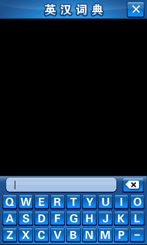 | — | ✅ Pass |
| 68 | 在线书城 | tmp/nicai_game/在线书城.CBE | 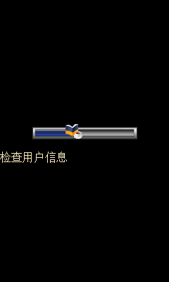 | 🌐 Required | ✅ Pass |
| 69 | 在线音乐 | tmp/nicai_game/在线音乐.CBE |  | 🌐 Required | ✅ Pass |
| 70 | 战争机器 | tmp/nicai_game/战争机器.CBE | 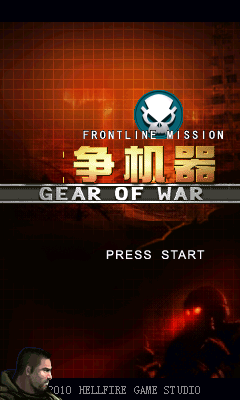 | — | ✅ Pass |
| 71 | 众神之战 | tmp/nicai_game/众神之战.CBE |  | — | ✅ Pass |
| 72 | 钻石迷情3 | tmp/nicai_game/钻石迷情3.CBE | 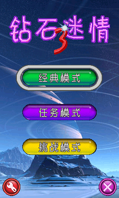 | — | ✅ Pass |
| 73 | AppStore | tmp/nicai_game/AppStore.CBE |  | 🌐 Required | ✅ Pass |
| 74 | Google地图 | tmp/nicai_game/Google地图.CBE |  | 🌐 Required | ✅ Pass |

## Known Limitations

- Persistent guest file storage is not implemented.
- Applications that require GPRS connectivity (marked 🌐 Required above) stop at their login, self-update, or connection-error screens. Their back-end servers were shut down years ago, so they would remain unusable even with a complete firmware network-manager implementation (which is itself not implemented).
- Core options are not yet available.
- File-based MP3 control is not implemented yet.
- The full 74-application validation corpus produces usable guest-rendered startup frames.
- Fixed-address big-endian lifecycle and less frequently used firmware services remain partial.
- Some successful captures contain only an early loading screen, dialog, or minimal startup UI.
- SCE/MAP/XSE resource parsers are inspection helpers; native executables run through the CPU core and service bridge.
- Compatibility with other resolutions and engine revisions is not guaranteed.

## Reporting a Compatibility Issue

Include the application resolution, the last visible screen, the input that triggers the problem, and the error text. When possible, reproduce it with `cbe_boot` and a short sequence of `--key-event FRAME:KEY` options. Do not attach copyrighted game packages to public issue reports.

The `cbe_boot` tool runs the same machine core without opening a window. A key event uses `FRAME:PHONE_KEY` syntax.

```bash
cargo run --release -p nicaiemu-tools --bin cbe_boot -- \
  path/to/game.CBE --frames 120 --key-event 1:14 --screenshot frame.png
```

Set `CBE_TRACE=all` to trace every bridged service, or provide comma-separated service filters such as `CBE_TRACE=4:24,6:3`. Tracing is disabled by default.
