# Game Compatibility

## PR 71 black-screen audit (2026-10-07)

At 799b41f, the three-library scan reported 249 successful process exits out of
250 files. That is not a compatibility result. A low-color/low-pixel filter
identified 90 candidates for visual and input inspection; it does not classify
all of them as black screens. Some show only an update prompt, and some have
monochrome interfaces. A usable startup must render correctly and accept its
expected input without an emulator fault, including network-dependent titles.

The A-library Metal new variant now passes startup file and record setup and
loads its title images and animation. Both native constructor tables must
initialize the picture library when it is recreated after loading. Screen and
window callbacks now execute rather than returning through inert methods.
However, continuation input is not yet validated: the user reports no response
to the confirm key at the prompt, and the native payment/property interface is
still incomplete. It remains failing and is not marked compatible. Other former
halt-only results can expose later missing interfaces after these repairs.

The three commits after 0efb157 fill Scene method slots, allocate an inert list
control and install inert Talker methods. Successful default scans after those
changes do not prove rendering or gameplay. The historical tables below retain
their original validation scope and are not a fresh all-variant certification.

The gameold drawing API (table offset 0x00..0x3c) is now implemented —
clipped image blits, full-screen draws, the number/UI-skin helpers, text and
clip control — and native dispatch sid 82 hands out the v3 gameold table the
native games call those slots through, with the v3 image-header layout (u32
width/height, 16-byte headers) applied consistently. The A-library new-variant
titles now render their real screens: 魔塔 shows its full main menu (76,800
pixels, 132 colours), and 疯狂斗地主 / 超级玛丽 / 绝密宝藏 / 喜羊羊与灰太狼@新 /
恶魔城 render menus or title screens instead of a blank framebuffer. One title
(王牌伞兵 new variant) regressed from an early loading screen to a blank
screen; it remains under investigation and is not claimed as fixed.

The A-library 战火军棋(新品) variant now renders its title, four-item menu,
purchase confirmation and help text. Keypad and pointer input can open these
panels without an emulator fault. Its record constructor previously overwrote
the adjacent resource package; startup also called the registered exit callback.
The repair bounds record initialization, preserves the callback lifecycle and
implements the allocation and UI-skin calls used by its panels. Registered
native screens poll input once per frame, avoiding duplicate menu actions.
Paid gameplay remains unvalidated; reaching the purchase prompt is startup
coverage, not evidence of a playable battle.

CBE applications in the local validation corpus were run by the standalone emulator with default or application-specific capture timing. Every screenshot below is the RGB565 framebuffer produced by guest execution. If an application stops, times out, or leaves a single-color framebuffer, the batch does not create a screenshot. A successful startup capture does not guarantee that every screen or gameplay path works correctly.

The Network column in the application list flags applications that require
the original phone's GPRS connection and cannot be used offline: their
WAP/GPRS-era back-end servers were shut down years ago, so they no longer
work even on original hardware.

For startup compatibility, a network-dependent application passes once it
starts without an emulator fault. Waiting for an unavailable external server
does not constitute a startup failure.

Games packaged for the original phone's rotated landscape display present the
240×400 framebuffer rotated 90 degrees counterclockwise as 400×240. The
orientation is resolved automatically from a content-identity profile keyed by
archive CRC-32 and size (not by file name), so the screenshots below match how
the titles appear on the original hardware.

## Supported Application Profile

The current core recognizes little- and big-endian ARM/Thumb CBE executables designed for a 240×400 display, including variable segment headers and fixed-address manager-directory variants. It implements the firmware subsets needed for memory blocks, native and installed data packages, image and text drawing, screen changes, sandboxed guest files, timers, keypad input, and touch input.

Validated behavior includes executable initialization, startup and narrative screens, archive extraction, file-backed resource-image decoding, Chinese text and HUD rendering, keypad input, screen-logic touch events (tap down/up/drag) with the LCD manager's point-in-rect hit test for tap-driven menus, fixed-point trigonometry, packed-rectangle collision detection, and continued frame execution. Guest-initiated exits through the ARM/Thumb semihosting interface are treated as normal halts, and headless capture preserves a valid guest-rendered framebuffer if a later callback stops.

Network application entry methods use a separate service table from the manager
initialization directory. They preserve the caller's descriptor and defer its
startup callback until the initiating call returns. This repairs the entry path
used by Small Cool V10; that variant still faults while constructing its list
control, so it is not yet counted as a successful startup.

## Wulin new variant validation

The new Wulin executable completes startup, including the first-run information
panel and its confirmation callback. Keypad checks cover menu selection, help
and return, character selection in both modes, the story map, dialogue, battle
actions and the return to dialogue after defeat. Both local archive variants
complete the idle startup check; the battle replay completes 5,000 frames without
a guest fault. Intentional menu exit reaches the normal halted state.

This validates the previously failing execution and rendering paths. It does not
establish complete playthrough, audio, every character or every stage support.
Billing and SMS responses are simulated locally and do not contact a carrier.

## QCIF Ebook timeout repair

QCIF Ebook previously parsed a fabricated one-byte HTTP response as a structured
packet, underflowed a field length and requested a 0xffffffff-byte host copy.
Correct offline GET completion avoids that invalid payload. Startup and 2,000
idle frames now complete without a fault or timeout; the local bookshelf page
renders and direction keys move its selection. Remote books and downloads are
not validated. The frontend retains its existing 240x400 output canvas for this
176x220 application; viewport sizing remains a separate limitation.

## Crazy Landlord new variant validation

The new variant previously jumped into heap data after its marshalled allocation
request overwrote a stack return address. Allocation now returns a scalar handle
whose fetch yields the actual buffer without modifying the argument frame.
The GameOld inclusive random-range and fixed-manager clock bindings also prevent
setup loops and frozen dealing. Rectangle text drawing restores help and HUD
labels from guest strings and stacked dimensions/colors.

Checks cover the menu, help, scores, locally simulated credits, room and character
selection, card selection/play and the round result. A scripted 5,000-frame run
remains Ready; menu exit halts normally. This is one round of coverage, not a
complete playthrough, all rules/rooms/characters or audio certification. Billing
does not contact a carrier.

## Westward Journey new variant startup validation

The new variant previously faulted at an unbound dirty-rectangle registration
callback. The native pool stores a bounded pointer array of signed rectangles;
its eight-byte listener preserves adjacent guest strings. Fetched GameOld tables
now bind image drawing exports to their actual implementations.

Startup renders the background, and confirm enters the title menu. Menu input
changes state without the original fault. Sprite animation and subsequent content
panels remain incomplete; this closes the startup execution failure, not the full
gameplay gap. Continued idle and scripted input are checked separately from visual
completeness.

## Shared-template execution validation (2026-10-11)

Native text measurements previously returned method-table addresses, corrupted
request arguments and recursively entered assertion rendering until the guest
stack was exhausted. Scalar GBK width and UCS2 length/width results now preserve
the requests and allow the original guest assertion handler to halt normally.

The entries below complete 2,000 frames and a confirm/direction/cancel replay
without emulator faults. All end at a guest assertion halt with a black frame.
They are **not usable or playable games**. Startup/package interfaces remain
incomplete; normal process completion is recorded separately from compatibility.

| Application | Execution result | Visual/gameplay status |
| --- | --- | --- |
| 三国大富翁 (new) | Guest assertion halt; no execution fault | Blank; incomplete startup |

## Summary

| Status | Count |
| --- | ---: |
| ✅ Pass | 74 |
| ❌ Fail | 0 |
| 🌐 Requires network | 17 |
| **Total** | **74** |

## Application List

The Network column marks applications whose content or gameplay requires the
original phone's GPRS connection: online game logins, network-fed content
services (news, books, music, maps, email, weather, time sync), and operator
download services (ringback tones, videos). The flags follow from guest calls
to the firmware network manager observed in headless service traces and from
the applications' own login or network screens shown in the screenshots.
Applications that only read billing identifiers at startup but remain fully
playable offline are not flagged.

| # | Application | File | Screenshot | Network | Status |
| ---: | --- | --- | --- | --- | --- |
| 1 | 暴打小猪 | tmp/nicai_game/暴打小猪.CBE |  | — | ✅ Pass |
| 2 | 暴力摩托 | tmp/nicai_game/暴力摩托.CBE | 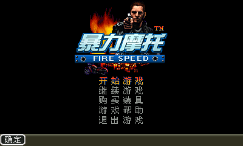 | — | ✅ Pass |
| 3 | 捕鱼猎人 | tmp/nicai_game/捕鱼猎人.CBE |  | — | ✅ Pass |
| 4 | 打地鼠 | tmp/nicai_game/打地鼠.CBE |  | — | ✅ Pass |
| 5 | 打火机 | tmp/nicai_game/打火机.CBE | 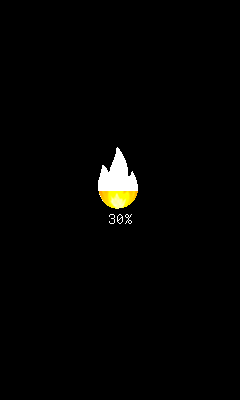 | — | ✅ Pass |
| 6 | 大家来数钱 | tmp/nicai_game/大家来数钱.CBE |  | — | ✅ Pass |
| 7 | 电子邮件 | tmp/nicai_game/电子邮件.CBE |  | 🌐 Required | ✅ Pass |
| 8 | 动感骰子 | tmp/nicai_game/动感骰子.CBE | 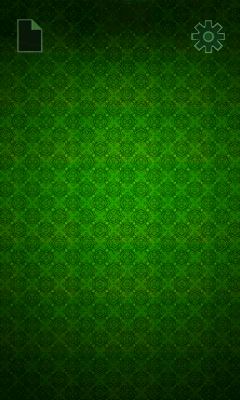 | — | ✅ Pass |
| 9 | 恶魔城 | tmp/nicai_game/恶魔城.CBE | 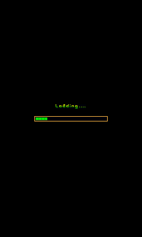 | — | ✅ Pass |
| 10 | 恶魔城登录版 | tmp/nicai_game/恶魔城登录版.CBE | 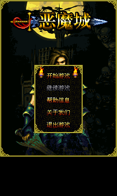 | 🌐 Required | ✅ Pass |
| 11 | 法老祖玛2 | tmp/nicai_game/法老祖玛2.CBE | 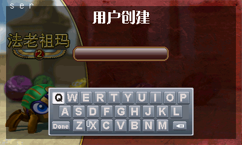 | — | ✅ Pass |
| 12 | 愤怒的小鸟 | tmp/nicai_game/愤怒的小鸟.CBE | 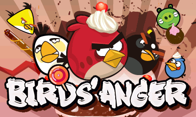 | — | ✅ Pass |
| 13 | 疯狂捕鸟 | tmp/nicai_game/疯狂捕鸟.CBE |  | — | ✅ Pass |
| 14 | 疯狂斗地主 | tmp/nicai_game/疯狂斗地主.CBE |  | — | ✅ Pass |
| 15 | 疯狂企鹅大冒险 | tmp/nicai_game/疯狂企鹅大冒险.CBE | 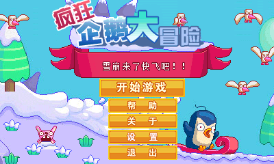 | — | ✅ Pass |
| 16 | 割绳子 | tmp/nicai_game/割绳子.CBE | 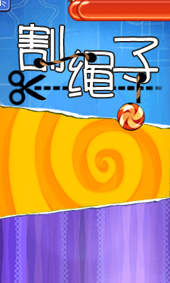 | — | ✅ Pass |
| 17 | 割绳子冬季版 | tmp/nicai_game/割绳子冬季版.CBE | 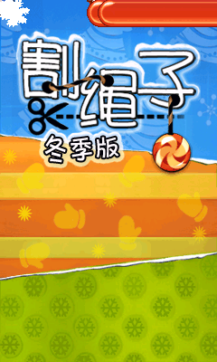 | — | ✅ Pass |
| 18 | 孤岛 | tmp/nicai_game/孤岛.CBE | 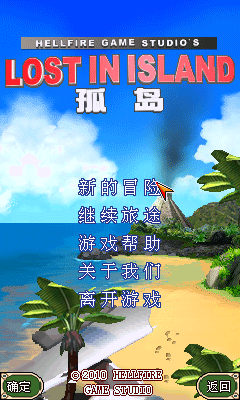 | — | ✅ Pass |
| 19 | 鬼吹灯 | tmp/nicai_game/鬼吹灯.CBE | 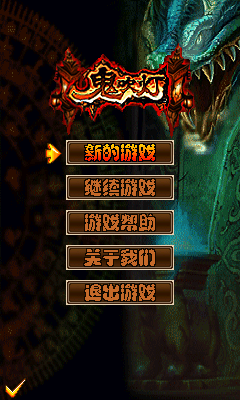 | — | ✅ Pass |
| 20 | 果蔬连连看 | tmp/nicai_game/果蔬连连看.CBE |  | — | ✅ Pass |
| 21 | 皇牌空战 | tmp/nicai_game/皇牌空战.CBE |  | — | ✅ Pass |
| 22 | 火辣美女视频 | tmp/nicai_game/火辣美女视频.CBE |  | 🌐 Required | ✅ Pass |
| 23 | 机场指挥部 | tmp/nicai_game/机场指挥部.CBE | 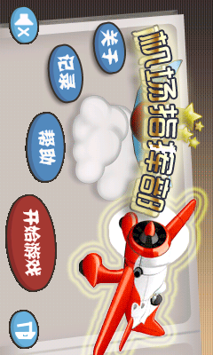 | — | ✅ Pass |
| 24 | 激情砖块 | tmp/nicai_game/激情砖块.CBE | 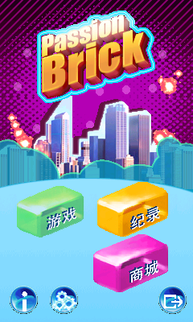 | — | ✅ Pass |
| 25 | 极品飞车2012 | tmp/nicai_game/极品飞车2012.CBE | 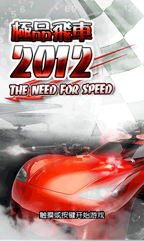 | — | ✅ Pass |
| 26 | 江湖Online | tmp/nicai_game/江湖Online.CBE |  | 🌐 Required | ✅ Pass |
| 27 | 僵尸先生 | tmp/nicai_game/僵尸先生.CBE |  | — | ✅ Pass |
| 28 | 开心大富翁 | tmp/nicai_game/开心大富翁.CBE |  | — | ✅ Pass |
| 29 | 雷电 | tmp/nicai_game/雷电.CBE | 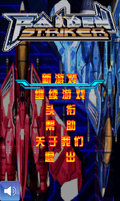 | — | ✅ Pass |
| 30 | 雷霆战机 | tmp/nicai_game/雷霆战机.CBE | 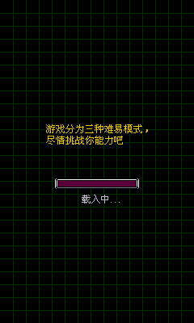 | — | ✅ Pass |
| 31 | 马戏团 | tmp/nicai_game/马戏团.CBE |  | — | ✅ Pass |
| 32 | 猫和老鼠 | tmp/nicai_game/猫和老鼠.CBE | 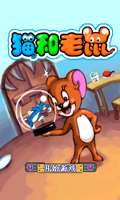 | — | ✅ Pass |
| 33 | 美女桌球 | tmp/nicai_game/美女桌球.CBE |  | — | ✅ Pass |
| 34 | 魔鬼理发师 | tmp/nicai_game/魔鬼理发师.CBE | 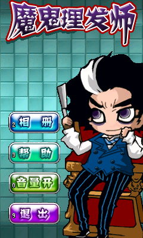 | — | ✅ Pass |
| 35 | 魔兽塔防 | tmp/nicai_game/魔兽塔防.CBE | 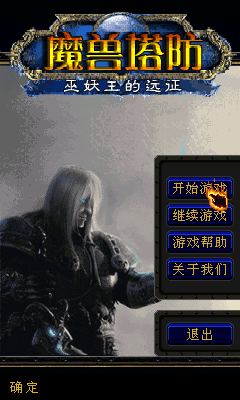 | — | ✅ Pass |
| 36 | 魔塔 | tmp/nicai_game/魔塔.CBE | 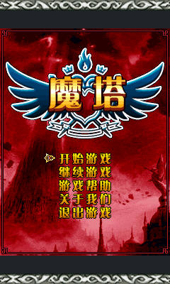 | — | ✅ Pass |
| 37 | 牧场物语 | tmp/nicai_game/牧场物语.CBE | 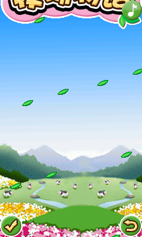 | — | ✅ Pass |
| 38 | 碰嘭球 | tmp/nicai_game/碰嘭球.CBE |  | — | ✅ Pass |
| 39 | 枪之荣誉 | tmp/nicai_game/枪之荣誉.CBE | 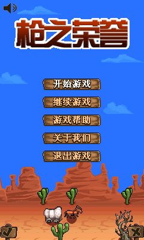 | — | ✅ Pass |
| 40 | 热辣美图 | tmp/nicai_game/热辣美图.CBE |  | — | ✅ Pass |
| 41 | 忍者跳跃 | tmp/nicai_game/忍者跳跃.CBE | 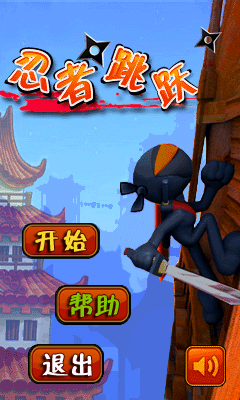 | — | ✅ Pass |
| 42 | 三国群殴传 | tmp/nicai_game/三国群殴传.CBE |  | — | ✅ Pass |
| 43 | 时间同步 | tmp/nicai_game/时间同步.CBE |  | 🌐 Required | ✅ Pass |
| 44 | 士兵突袭 | tmp/nicai_game/士兵突袭.CBE | 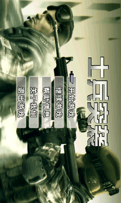 | — | ✅ Pass |
| 45 | 世纪佳缘 | tmp/nicai_game/世纪佳缘.CBE |  | 🌐 Required | ✅ Pass |
| 46 | 水果达人 | tmp/nicai_game/水果达人.CBE | 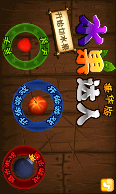 | — | ✅ Pass |
| 47 | 天气精灵 | tmp/nicai_game/天气精灵.CBE |  | 🌐 Required | ✅ Pass |
| 48 | 涂鸦跳跃 | tmp/nicai_game/涂鸦跳跃.CBE | 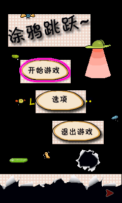 | — | ✅ Pass |
| 49 | 歪歪猫发条城历险记V100 | tmp/nicai_game/歪歪猫发条城历险记V100.CBE |  | 🌐 Required | ✅ Pass |
| 50 | 万年历 | tmp/nicai_game/万年历.CBE | 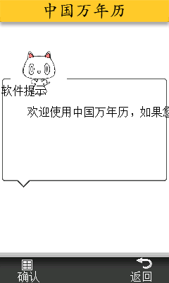 | — | ✅ Pass |
| 51 | 武林外传(新品) | tmp/nicai_game/武林外传(新品).CBE |  | — | ✅ Pass |
| 52 | 武林外传V10 | tmp/nicai_game/武林外传V10.CBE |  | — | ✅ Pass |
| 53 | 吸血鬼猎人 | tmp/nicai_game/吸血鬼猎人.CBE | 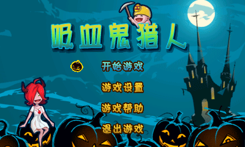 | — | ✅ Pass |
| 54 | 现代情趣大全 | tmp/nicai_game/现代情趣大全.CBE |  | — | ✅ Pass |
| 55 | 消息盒子 | tmp/nicai_game/消息盒子.CBE |  | — | ✅ Pass |
| 56 | 小酷 | tmp/nicai_game/小酷.CBE | 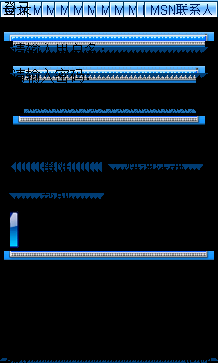 | — | ✅ Pass |
| 57 | 小鸟愤怒冬季版 | tmp/nicai_game/小鸟愤怒冬季版.CBE | 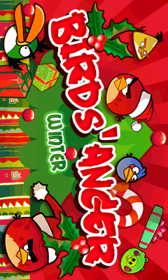 | — | ✅ Pass |
| 58 | 笑死人 | tmp/nicai_game/笑死人.CBE |  | — | ✅ Pass |
| 59 | 新闻 | tmp/nicai_game/新闻.CBE | 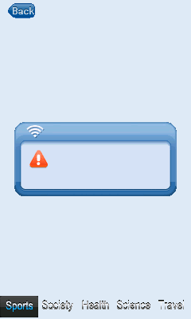 | 🌐 Required | ✅ Pass |
| 60 | 幸运扑克机 | tmp/nicai_game/幸运扑克机.CBE | 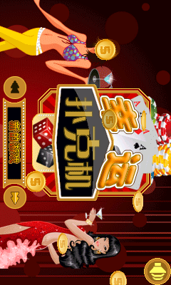 | — | ✅ Pass |
| 61 | 性爱宝典 | tmp/nicai_game/性爱宝典.CBE |  | — | ✅ Pass |
| 62 | 性爱高手 | tmp/nicai_game/性爱高手.CBE | 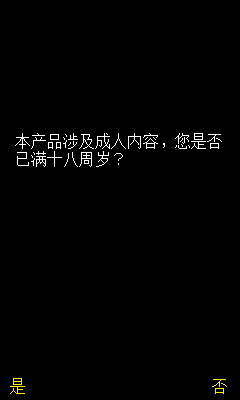 | — | ✅ Pass |
| 63 | 雄霸天下 | tmp/nicai_game/雄霸天下.CBE |  | 🌐 Required | ✅ Pass |
| 64 | 炫酷音乐彩铃 | tmp/nicai_game/炫酷音乐彩铃.CBE |  | 🌐 Required | ✅ Pass |
| 65 | 血剑Online | tmp/nicai_game/血剑Online.CBE |  | 🌐 Required | ✅ Pass |
| 66 | 移淘网 | tmp/nicai_game/移淘网.CBE |  | 🌐 Required | ✅ Pass |
| 67 | 英汉词典 | tmp/nicai_game/英汉词典.CBE | 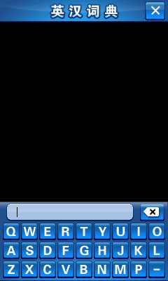 | — | ✅ Pass |
| 68 | 在线书城 | tmp/nicai_game/在线书城.CBE | 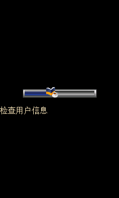 | 🌐 Required | ✅ Pass |
| 69 | 在线音乐 | tmp/nicai_game/在线音乐.CBE |  | 🌐 Required | ✅ Pass |
| 70 | 战争机器 | tmp/nicai_game/战争机器.CBE | 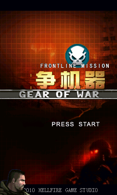 | — | ✅ Pass |
| 71 | 众神之战 | tmp/nicai_game/众神之战.CBE |  | — | ✅ Pass |
| 72 | 钻石迷情3 | tmp/nicai_game/钻石迷情3.CBE | 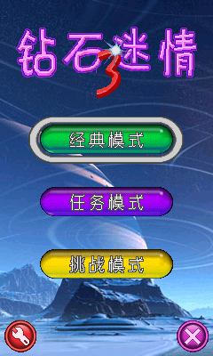 | — | ✅ Pass |
| 73 | AppStore | tmp/nicai_game/AppStore.CBE |  | 🌐 Required | ✅ Pass |
| 74 | Google地图 | tmp/nicai_game/Google地图.CBE |  | 🌐 Required | ✅ Pass |

## Requested V10 Variant Checks

These checks are separate from the 74-application table above. Startup passes
for SMS-dependent titles after reaching their usable title/purchase screens;
this does not validate gameplay behind an unavailable purchase service.

| Variant | Verified result | Remaining limitation |
| --- | --- | --- |
| Three Kingdoms new V10 | Menu, introduction, purchase, offline failure recovery | Battle not validated behind SMS purchase |
| Undercover V10 | Full cover, purchase and payment-failure screen | Gameplay not validated behind SMS purchase |
| Soldier Assault V10 | Cover, introduction, purchase screen | Gameplay not validated behind SMS purchase |
| Double Dragon V10 | Title and introduction | Gameplay faults in an uninitialized DF Scene window; window-only experiment then faults in Actor methods |
| Westward Journey V10 | Resource load precedes initialization; background draws | Startup still faults in the missing Talker repaint method |
| Super Bubble V10 | Early loading screen | Startup faults in the uninitialized DF Scene window |
| Super Mario V10 | Title | Entering gameplay faults in the uninitialized DF Scene window |

The Scene window is embedded at offset 0x628 in all three affected titles.
Available API descriptions identify the constructors but do not specify the
complete Scene/Actor or Listener/Talker layouts. Their behavior is not replaced
with generic successful stubs, and these four variants remain failing.

## Known Limitations

- Westward Journey V10 now loads requested screen resources before initialization,
  avoiding its first null object call. It still faults in an unimplemented
  Talker repaint method and is not yet startup-compatible.
  Fixed GameManager image and clip services now share GameLCD drawing, so its
  background is drawn before that remaining failure.

- Double Dragon V10 now renders its title and introduction after isolating
  unknown object methods from global manager stubs. Entering gameplay still
  faults in an unimplemented scene-object method; gameplay is not compatible.

- Undercover V10 now shows its full title cover and continue prompt, and
  confirms into the purchase screen after font, window and fixed picture-library
  repairs. Startup is verified; actual gameplay still requires offline SMS
  purchase and has not been validated.

- The A-library Three Kingdoms new variant now loads its dynamic executable
  after correcting resource-package classification. Its main menu renders after
  bounded text-box initialization and picture-library support. Legacy GameLCD
  drawing and text-box methods now show the introduction and purchase text.
  The modal purchase flow can pause and restore callbacks without a runtime
  fault. Startup/menu and purchase-failure recovery are verified; actual play
  remains blocked by the offline SMS purchase flow and has not been validated.

- Persistent guest file storage is not implemented.
- The firmware network manager implements a minimal offline mock (connect/send/close/http-get plus deferred callbacks). Login-gated titles such as 恶魔城登录版 can leave their wait screen and render the title menu, but there is no live GPRS server, no persistent online session, and most 🌐 Required applications still stop after the mock handshake.
- 战争机器 exits itself a few seconds after the background-intro screens are left idle: its intro timer loads the level-0 map (`map0d.map`), which the package does not contain, and the game's C runtime hits a divide-by-zero and calls `exit()`. The emulator now treats that semihosting exit as a normal halt, so the frontend keeps showing the last frame (press `R` to restart) instead of closing.
- Core options are not yet available.
- File-based MP3 control is not implemented yet.
- The full 74-application validation corpus produces usable guest-rendered startup frames.
- Fixed-address big-endian lifecycle and less frequently used firmware services remain partial.
- Some successful captures contain only an early loading screen, dialog, or minimal startup UI.
- SCE/MAP/XSE resource parsers are inspection helpers; native executables run through the CPU core and service bridge.
- Compatibility with other resolutions and engine revisions is not guaranteed.

## Reporting a Compatibility Issue

Include the application resolution, the last visible screen, the input that triggers the problem, and the error text. When possible, reproduce it with `cbe_boot` and a short sequence of `--key-event FRAME:KEY` options. Do not attach copyrighted game packages to public issue reports.

The `cbe_boot` tool runs the same machine core without opening a window. A key event uses `FRAME:PHONE_KEY` syntax.

```bash
cargo run --release -p nicaiemu-tools --bin cbe_boot -- \
  path/to/game.CBE --frames 120 --key-event 1:14 --screenshot frame.png
```

Set `CBE_TRACE=all` to trace every bridged service, or provide comma-separated service filters such as `CBE_TRACE=4:24,6:3`. Tracing is disabled by default.
